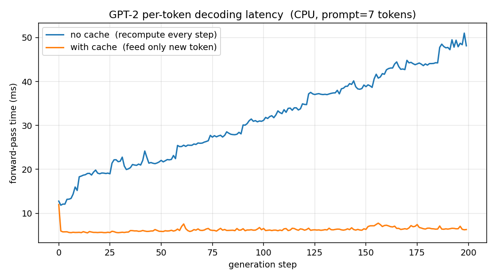
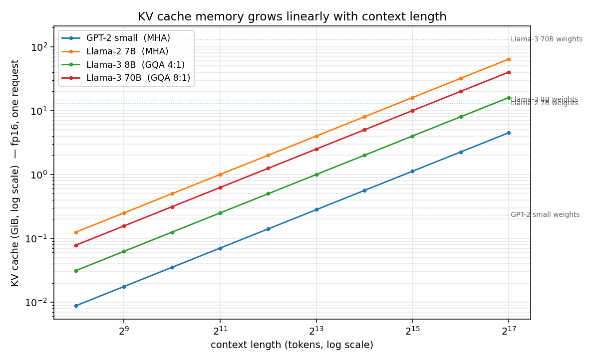

# KV Cache: 一个能跑的 demo

Transformer 自回归推理时，每生成一个新 token 都要让它"看见"前面所有 token。
朴素做法是每步把整段前缀重新过一遍模型；KV cache 的洞察是——前面那些 token
的 K 和 V **一旦算出来就再也不会变**，所以缓存起来、增量更新就行。

这个目录里有三个能跑的脚本，从机制、效益、成本三个维度把这件事讲清楚。

```
toy_attention.py   单层手撸 attention，证明"有 cache" 与"无 cache"输出完全一致
hf_benchmark.py    GPT-2 真实 decoding，对比每 token 延迟（5x speedup）
kv_memory.py       多个真实模型的 KV 显存账本（含 GQA 影响）
results/           上面两个脚本生成的图和 JSON
```

---

## 1. 为什么 K/V 能 cache，Q 不能

自注意力的核心三步（单 head 简化）：

```
Q_i = x_i W_Q       K_i = x_i W_K       V_i = x_i W_V
attn_i = softmax( Q_i · K[0..i]^T / √d ) · V[0..i]
```

因为是 **causal** 注意力，position `i` 只看 `[0..i]`，不看未来。所以：

- **`K_i` 和 `V_i` 只依赖 `x_i`**——一旦 token `i` 落定，它的 K/V 永远不变。
  → 算一次、存起来、之后所有步骤复用。
- **`Q_i` 是"当前要回答的提问"**——在第 t 步我们只关心 `Q_t`（新 token 的 query），
  历史的 Q 已经用过、不再需要。
- **softmax 必须重新算**：每一步的 attn scores 都是新 Q 跟全部历史 K 的内积，
  没法 cache 这一步本身——但被 cache 的是它的输入 K、V。

所以一次 decoding step 的工作量从 **"O(seq_len) 个 K/V 投影 + O(seq_len²) 注意力"**
降到 **"O(1) 个 K/V 投影 + O(seq_len) 注意力"**。

`toy_attention.py` 验证了这个不变量：

```
Output sequences identical : True
Max per-step |logit diff|  : 1.19e-07     ← 浮点噪声
Invariant K(prompt alone) == K(prompt within full seq) : True
```

最后一行就是关键——把 prompt 单独跑出来的 K，和把 prompt 嵌在更长序列里跑出来的 K
（取前缀部分），逐元素相等。这就是缓存合法性的根基。

---

## 2. 效益：GPT-2 真实 decoding（CPU）

`hf_benchmark.py` 对同一个 prompt 用两种策略各 greedy decode 200 个 token：

| 策略 | 吞吐 (tok/s) | 总耗时 | TPOT (ms/tok) |
|---|---:|---:|---:|
| `use_cache=False`（每步重算前缀） | **31.7** | 6.31 s | 31.5 |
| `use_cache=True`（喂新 token + cache） | **159.2** | 1.26 s | 6.3 |

**5x 吞吐提升**，输出完全一致（两条路径在数值上等价）。TTFT（首 token / prefill 耗时）= 12.0 ms。

> 行业指标：throughput/TPS 是头条数字；TPOT/ITL 衡量流式体验；TTFT 衡量首字延迟。
> 下面这张是 per-token 延迟（用 ms 是为了直接看出"每步成本随 seq 怎么涨"）。

每 token 延迟曲线：



读图：

- **蓝线（无 cache）从 12 ms 涨到 ~50 ms。** 因为第 t 步要把长度为 `prompt_len + t`
  的整段序列重新过一遍模型——序列越长，K/V 投影和注意力的总工作量越大，近似线性增长。
- **橙线（有 cache）几乎平在 6 ms。** 每步只对 1 个新 token 算 Q、K、V，注意力对
  历史 K/V 做一次 O(seq_len) 的扫描。在小模型 + 短序列下，瓶颈是固定的 MLP / 投影开销，
  attention 的线性增长几乎看不出来。

这个 5x 是 CPU 上 GPT-2、200 token 的数字——序列越长、模型越深，KV cache 的
收益越夸张（因为 baseline 是 O(n²) 累计计算）。

---

## 3. 成本：KV 占多少显存？

公式（一个请求）：

```
bytes_per_token = 2 × n_layers × n_kv_heads × head_dim × dtype_bytes
                  ↑                ↑
                  K 和 V           GQA 时 n_kv_heads << n_attn_heads
```

`kv_memory.py` 跑出来的几个常见模型（fp16，单请求）：

| 模型 | layers | attn_h | kv_h | head_d | KV/token | 备注 |
|---|---:|---:|---:|---:|---:|---|
| GPT-2 small | 12 | 12 | 12 | 64 | 36 KiB | MHA |
| GPT-2 XL | 48 | 25 | 25 | 64 | 300 KiB | MHA |
| Llama-1 / 2 7B | 32 | 32 | 32 | 128 | 512 KiB | MHA |
| Llama-2 70B | 80 | 64 | 8 | 128 | 320 KiB | GQA 8:1 |
| Llama-3 8B | 32 | 32 | 8 | 128 | 128 KiB | GQA 4:1 |
| Llama-3 70B | 80 | 64 | 8 | 128 | 320 KiB | GQA 8:1 |
| Qwen2.5 7B | 28 | 28 | 4 | 128 | 56 KiB | GQA 7:1 |
| Mistral 7B | 32 | 32 | 8 | 128 | 128 KiB | GQA 4:1 |

放到不同 context 长度下（一个用户、fp16）：

| 模型 | 2K | 8K | 32K | 128K | 权重(fp16) |
|---|---:|---:|---:|---:|---:|
| GPT-2 small | 72 MiB | 288 MiB | 1.12 GiB | 4.50 GiB | 237 MiB |
| Llama-2 7B | 1.0 GiB | 4.0 GiB | 16 GiB | 64 GiB | 13 GiB |
| Llama-3 8B | 256 MiB | 1.0 GiB | 4.0 GiB | 16 GiB | 14.9 GiB |
| Llama-3 70B | 640 MiB | 2.5 GiB | 10 GiB | 40 GiB | 130 GiB |



几个一眼能读出来的事实：

1. **KV 随 context 线性增长。** 每多一个 token 就固定多一份 KV，没有任何摊销。
2. **GQA 是显存救星。** Llama-3 8B 的 KV/token 只有 Llama-1 7B 的 1/4——结构里
   `n_layers / head_dim` 完全一样，差别只在 `n_kv_heads` 从 32 降到 8。Llama-3 70B
   如果用 MHA，它在 32K 的 KV 会是 80 GiB 而不是 10 GiB，根本不可能上线。
3. **服务端是 KV 受限，不是权重受限。** 权重一份所有用户共享；KV 是每用户、每 token。
   `B` 个并发请求 × `L` 长度 × `bytes_per_token` 才是真实显存账。Llama-3 70B 在
   一张 H100（80 GiB）上想服务 100 个 8K context 用户，光 KV 就 250 GiB，装不下。

---

## 4. 由此引出的工程问题

KV cache 把推理从 O(n²) 拉回 O(n)，但它本身又成了新瓶颈。后面这些都是绕着 KV 转：

- **PagedAttention / vLLM** —— 把 KV 切成固定大小的 page，按需分配，避免长短不一的
  请求互相挤压留下碎片。本质是把 OS 虚拟内存那套搬到 KV 上。
- **Prefix caching** —— 多个请求共享同一段系统提示？那段 prefix 的 KV 算一次，
  跨请求复用。这就是 Anthropic、OpenAI 的 **prompt caching** 在做的事。
- **KV 量化（int8 / fp8 / KIVI）** —— K/V 用低精度存，可以再砍 2~4 倍显存，
  对生成质量影响通常小于权重量化。
- **MLA（DeepSeek Multi-head Latent Attention）** —— 把 K、V 投影到一个共享的低维
  latent，存 latent 而不是完整 K、V，再在 attention 里实时还原。是 GQA 之后下一个
  量级的压缩思路。
- **Sliding window / streaming** —— Mistral、Gemma 等限制每个 token 只能看最近 W 个
  位置，KV cache 也只保留最近 W，把"线性增长"硬截断成常数。

---

## 复现

```bash
cd 2026/kv-cache

python3 toy_attention.py     # 几秒，证明数值一致
python3 hf_benchmark.py      # ~30 秒（首次会下 GPT-2 weights）
python3 kv_memory.py         # 瞬间，纯算术 + 出图
```

输出在 `results/`：`hf_benchmark.json`、`kv_memory.json`、两张延迟图、一张显存图。

依赖：`torch` `transformers` `numpy` `matplotlib`（CPU 即可，全程不需要 GPU）。
