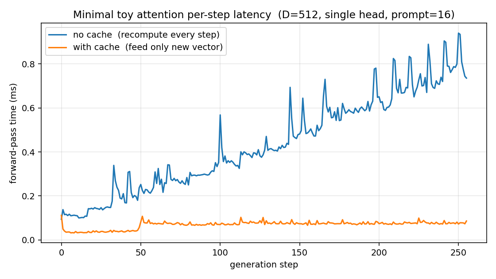

# 30 行代码，把 KV cache 的 O(n²) → O(n) 跑给你看

> 配套代码：`toy_attention_min.py`（机制 + 数值等价证明，64 行）、`toy_min_benchmark.py`（同款风格 + 时延对比 + 出图）。`toy_attention.py` 是带 `nn.Module` 的稍微完整版本，证 K 不变量。

KV cache 在生产框架里被 fused kernel、paged allocator、CUDA stream 包裹得很厚，
看不清。这篇用**单 head、纯函数、无 `nn.Module`、4 个权重矩阵**的玩具把它跑出来，
看一眼曲线就知道 cache 在干什么。

---

## 1. 模型有多少代码

整个"模型"就是 4 个矩阵 + 一个函数：

```python
D = 512
W_q = torch.randn(D, D) / D**0.5
W_k = torch.randn(D, D) / D**0.5
W_v = torch.randn(D, D) / D**0.5
W_o = torch.randn(D, D) / D**0.5

def attn(x, k_cache=None, v_cache=None):
    q = x @ W_q
    k_new = x @ W_k
    v_new = x @ W_v
    k = k_new if k_cache is None else torch.cat([k_cache, k_new], dim=0)
    v = v_new if v_cache is None else torch.cat([v_cache, v_new], dim=0)

    # causal mask: row i (over q) sees cols [0 .. T_past + i]
    T_new, T_tot = q.shape[0], k.shape[0]; T_past = T_tot - T_new
    i = torch.arange(T_new).unsqueeze(1); j = torch.arange(T_tot).unsqueeze(0)
    mask = torch.where(j <= T_past + i, 0.0, float("-inf"))

    scores = q @ k.T / D**0.5 + mask
    return torch.softmax(scores, dim=-1) @ v @ W_o, k, v
```

没有 multi-head、没有 FFN、没有 LayerNorm、没有 embedding——输入就是一段已经
embed 好的向量。**任何一行都能直接 step into**。

---

## 2. 两条 decoding 路径

```python
# A) 朴素：每步把整段序列重新过一遍
for _ in range(N_GEN):
    y, _, _ = attn(seq)
    seq = torch.cat([seq, y[-1:]], dim=0)         # 把最后一个输出当新 token

# B) KV cache：第一次 prefill，之后每步只喂上一步的输出向量
y, k_cache, v_cache = attn(prompt)                # prefill
seq = torch.cat([prompt, y[-1:]], dim=0)
next_vec = y[-1:]
for _ in range(N_GEN - 1):
    y, k_cache, v_cache = attn(next_vec, k_cache, v_cache)
    next_vec = y[-1:]
    seq = torch.cat([seq, next_vec], dim=0)
```

> 没有 lm_head + argmax，所以"下一个 token"我们直接用上一步的输出向量本身代替。
> 这不是真实 LLM 的 decoding（真的会做 logits → argmax），但**算的工作量、cache 的
> 行为、O(n²) → O(n) 的曲线形状**完全一样——这才是这个 demo 想说明的事。

Prompt = 16 个随机 512 维向量，各跑 256 步：

| 策略 | 吞吐 (tok/s) | 总耗时 | TPOT (ms/step) | 第 1 步 | 最后一步 |
|---|---:|---:|---:|---:|---:|
| 无 cache | **2,280** | 0.11 s | 0.44 | 0.09 ms | 0.74 ms |
| 有 cache | **14,565** | 0.02 s | 0.07 | 0.11 ms (TTFT) | 0.09 ms |

**6.4x 吞吐提升**。两条路径输出向量的最大绝对差 = 1.19e-07（浮点噪声）：

```
Max |seq_a - seq_b| = 1.19e-07   (allclose: True)
```

---

## 3. 曲线：线性 vs 平坦



读图：

- **蓝线（无 cache）**：0.1 ms → 0.8 ms，**斜率正的近似直线**。
  第 t 步的输入序列长度是 (16 + t)，每步要做：
  - 3 个投影 `q/k/v = x @ W`：O((16+t) · D²)
  - attention `q @ k.T`：O((16+t)² · D)
  - 加权 `attn @ v` + 输出投影：O((16+t)² · D + (16+t) · D²)

  合在一起，每步成本随 t 线性增长（因为序列长度本身就线性增长）。
  cumulative 总时间是 O(n²)。

- **橙线（有 cache）**：稳在 ~0.07 ms。
  - 投影只对 1 个新向量算：O(D²)，**与 t 无关**
  - attention 是 1 个新 q 对历史 k 的扫描：O((16+t) · D)，理论上有线性增长

  在 256 步这个量级上，attention 的 O(t·D) 还远小于投影的 O(D²) = O(512²)，
  所以橙线看起来是平的。如果跑到 4K+ steps，橙线也会开始爬，但斜率比蓝线小一个
  数量级——这正是 vLLM 那些工程优化继续要压平的地方。

---

## 4. 为什么这事能成立

数学根基：causal attention 里 `K_i = x_i · W_K`，**K_i 只依赖 token i 自己**。
未来的 token 不影响 K_i。所以一旦 token i 落定，K_i 永远不变，可以放心存。
V 同理。

`toy_attention.py` 里直接验证了这个不变量：

```python
_, (K_prompt_only, _) = model(prompt)             # K of prompt alone
_, (K_full, _)        = model(full_seq)           # K of prompt within longer seq
K_prefix = K_full[:, :, :prompt.shape[1], :]
assert torch.allclose(K_prompt_only, K_prefix, atol=1e-6)   # ← True
```

把 prompt 单独跑出来的 K，和把 prompt 嵌在更长序列里跑出来的 K（取前缀部分），
**逐元素相等**。这就是缓存合法性的全部根基。

Q 也只依赖当前 token，但生成时我们**只关心 Q_t**（新 token 想问什么），历史的 Q 用过即弃，
没必要存。

---

## 5. 这 KV 占多大

跑完 16 + 256 = 272 个向量后：

```
Final cache: K (271, 512)   V (271, 512)
1,110,016 bytes  (1.08 MiB)
```

公式（这个 toy）：`2 × seq_len × D × dtype_bytes` = `2 × 271 × 512 × 4` = 1,110,016 ✓

通用公式（真实模型，多层 + 多头 + GQA）：

```
bytes_per_token = 2 × n_layers × n_kv_heads × head_dim × dtype_bytes
```

放到生产模型上比例会反过来——见 `kv_memory.py`：Llama-3 70B 在 32K context
单请求就要 10 GiB KV，权重 130 GiB。再乘并发用户数，就是 vLLM、PagedAttention、
prefix caching、KV 量化、MLA 等一连串工程要解决的核心问题。

---

## 6. 复现

```bash
python3 toy_min_benchmark.py
```

输出：
- `results/toy_min_benchmark.json`（每步的两组 ms）
- `results/toy_min_latency_per_token.png`（上面那张图）
- `results/toy_min_latency_cumulative.png`（累计耗时）

依赖：`torch` `matplotlib`，CPU 即可，~1 秒跑完。

```
toy_attention_min.py     64 行，机制 + 数值等价
toy_min_benchmark.py     ~30 行模型代码 + decode/计时/出图
toy_attention.py         单层 nn.Module 版本，证 K 不变量
```

读懂 `toy_attention_min.py` 就读懂了 KV cache。
